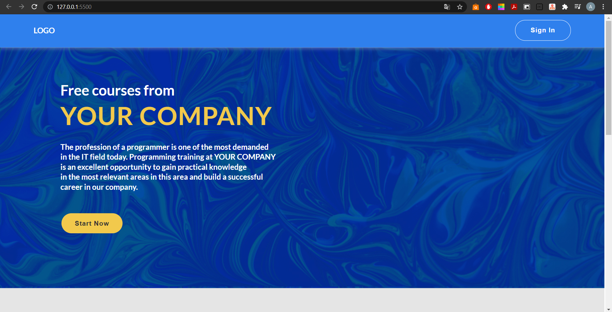
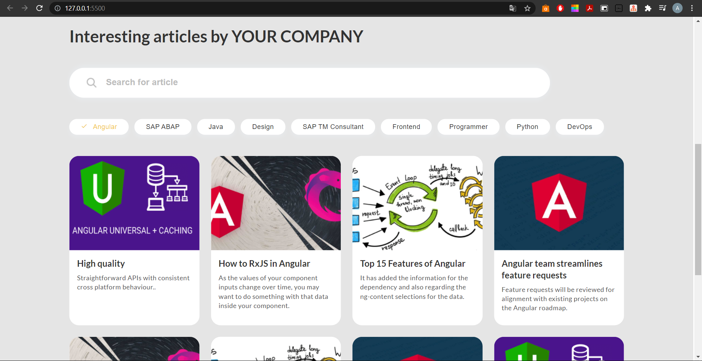
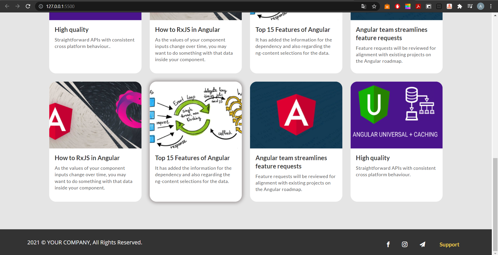

<h1 align="center">Layout Free Courses</h1>

## Description

**Homepage**

<h2 align="center">Live Demo</h2>

**Layout Animation**

    

    
    This work is coding the layout using HTML, CSS. The layout consists of a header, main part and a futer. The header includes a company logo and
    a sign in button. The main part includes brief information about the courses and a list of interesting articles on the selected topic. The
    footer contains links to social networks such as facebook, instagram and telegram and a support button. You can use this layout as an
    advertisement of your courses.

## Click edition

- **Use** your mouse to move around the layout and view the animation.